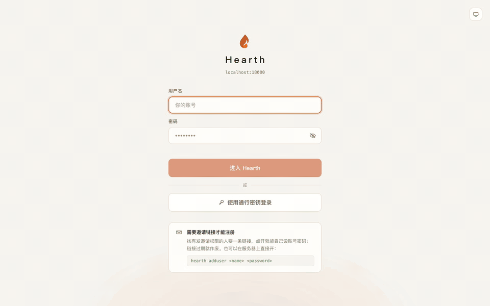

[中文](README.md)

#  Hearth

**Self-hosted rooms for voice, screen sharing, OBS ingest and chat.**

A hearth is the fireside people once gathered around to talk. Hearth is that gathering for a few friends online: one channel, voices, and a shared screen.
It is a private living room for a handful of friends, not a Discord replacement: it covers the part Discord does poorly or cannot do at all, namely picture quality, latency, running from home, and keeping the data on your own machine.

Open a channel, get a few people in, put your screen up. Group voice, 1080p60 screen sharing at a real bitrate, OBS pushing straight in, and chat with mentions and file transfer — all one thing.
One binary holds all of it: the API, the media core, the ingest endpoint and the web UI. No redis, no second container, no separate media server to install.
Your data lives in the one directory you mounted, and video never even passes through the server — it only handles auth, signalling and same-origin proxying, so a machine with a thin uplink can still carry it.



## What it does

**Voice**

- Group voice forwarded by an SFU; joining a channel negotiates the connection for you
- Noise suppression and echo cancellation, push-to-talk, auto-mute when you go idle
- Speaking highlights, a local level meter, one account present from several devices at once, and reconnects that survive a server restart

**Screen sharing and ingest**

- Browser screen sharing carries system audio; the camera rides the same line
- Three encoder presets: layered VP9 / AV1 SVC (weak viewers drop a layer instead of dragging the room down) and single-layer H.264. Bitrate, frame rate and resolution are adjustable, and hardware vs. software encoding is labelled from what the browser actually reports
- OBS pushes in over plain WHIP with no plugin: the channel goes in the server URL and every user gets their own token. The server forwards the stream untouched, so HEVC and AV1 pass through
- Theater mode, fullscreen and picture-in-picture

**Chat**

- Messages fan out live over the media core's data channel; the server stores text history so it replays
- Mentions, replies and emoji reactions. Images and files stream peer to peer and never hit disk, so only the people online at the time receive the bytes
- Mute is per person, per channel

**Notifications**

- A sound while the page is open, a system notification once it is in the background, and web push for mentions and replies after the page is closed
- Unread counts land on the tab title and the app icon badge

**Accounts and permissions**

- Passkeys sign you in with one touch; passwords remain as the fallback, and sessions can be signed out remotely
- Registration is invite-only by default, and the first account becomes the super admin
- Guest links can be scoped to a single channel; letting guests convert to a real account is off by default (`guest_claim`)
- Five system roles, `guest < user < power < admin < super`, over three channel roles, `owner / moderator / member`

**Deployment**

- One file for Windows, macOS and Linux that can install itself as a system service; one docker image otherwise
- HTTPS built in: one port serves both http and https, with a choice of three certificate sources (a self-signed root CA, an external certificate file, or one uploaded from the admin console)
- Behind NAT it asks the gateway for port mappings itself (PCP / NAT-PMP / UPnP IGD)
- A changed public address or mapping costs neither a restart nor a live session
- The stage line (screen sharing and ingest) can move wholesale to a machine with a better uplink

**Diagnostics**

- RTT, jitter, loss and transport per line (UDP, TCP fallback, relay fallback), refreshed every 5 seconds
- Screen share tiles report receive-side buffer and decode times plus send-side encode time and what is limiting it
- An end-to-end latency ruler (`#/latency`) that measures the whole path: capture, encode, forward, decode, render

> **Note:** The UI is currently Chinese-only; an English UI is planned. The screenshots on this page and the menu names quoted below are Chinese for that reason.

## Up and running in three minutes

### docker compose

```yaml
services:
  hearth:
    image: ghcr.io/xiaoshao9704/hearth:latest
    restart: unless-stopped
    ports:
      - "8080:8080"
      - "47720:47720/udp"
      - "47720:47720/tcp"
    volumes:
      - hearth-data:/data

volumes:
  hearth-data:
```

```bash
docker compose up -d
docker compose exec hearth /app/hearth adduser <name> <password>   # the first account becomes super
```

Open `http://<host>:8080` and you are done: voice, screen sharing, camera and OBS ingest all work without touching the admin console.
The same port also serves `https://<host>:8080` by default (merged mode: one port auto-detects the protocol per connection). Other devices on the LAN need to install a root certificate the first time — open `https://<host>:8080/ca` (plain http works too) for the install steps, a couple of minutes at most — then use the https address, since microphone, screen share and notifications all need it. `http://localhost:8080` on the host itself is unaffected; localhost is already a secure context.

- `47720/udp` is the media port (voice and video share it; the public IP is discovered automatically) and has to be open in your firewall or security group. **Docker cannot add a published port to a running container**, so write it in when you create it.
- `47720/tcp` only matters on networks that hijack UDP: set *Stage → ICE-TCP port* in the admin console to the same number (47720 by default), then allow both udp and tcp on it.
- The `/data` volume is the only persistence boundary — the database and the auto-generated keys both live there, so mounting it is your backup story.

### Single file (Windows / macOS / Linux)

Releases ship one executable per platform with the web UI compiled in, so the archive contains a single file:

```bash
./hearth                 # listens on :8080
./hearth adduser alice <password>
./hearth service install # install as a system service (optional)
```

Open `http://localhost:8080` — on localhost the browser lets the microphone and screen capture work without HTTPS. The same port also serves `https://` by default (merged mode): other devices on the LAN need to install a root certificate first, at `https://<this machine's address>:8080/ca` (plain http works too), then switch to the https address for microphone and screen share to be allowed. Data goes to a `data/` directory next to the executable, falling back to the OS user data directory when that is not writable; `--data <dir>` or `HEARTH_DATA` overrides it. The macOS build is unsigned, so right-click → Open the first time. On Windows the first bind pops the firewall prompt; choose Allow.

### Behind a reverse proxy

Kernel signalling and WHIP live under `/providers/{alias}` on the same port as the web UI and API, so no proxy is required. If you put one in front, four things matter:

- Pass `Host` through: the passkey RP ID and the web push contact address are both derived from it
- Pass `X-Forwarded-Proto` through: it is how a TLS-terminating deployment derives an `https://…` origin
- Allow the WebSocket upgrade: signalling is a WebSocket
- **The media port does not go through the proxy** — open it straight to the host
- If the proxy terminates TLS itself, point it at hearth's port with plain `http://`; to stop hearth from also serving TLS, set `tls_cert_source` to `off` (or lock it with the `TLS_CERT_SOURCE=off` environment variable, read-only in the console)

## Deployment shapes

**One machine (the default).** Voice, stage and ingest all run on `lkembed`, the built-in instance inside the hearth process — a patched fork of LiveKit running in-process. No second process, no redis, no ingress. This is already the complete feature set; the two shapes below are optional.

**Stage line on another machine.** When the hearth host has a thin uplink, screen share and OBS video should not detour through it. Run a single `stage` container elsewhere (image `ghcr.io/xiaoshao9704/hearth-stage`, or the `stage-linux-amd64` / `stage-linux-arm64` single files from Releases): it requests its own port mappings and discovers and announces its own external addresses, with browser viewers and OBS arriving on the same punched-out UDP port. On the hearth side it is just an external `livekit` instance — the `LIVEKIT_API_URL/KEY/SECRET` environment variables synthesize a locked instance, or you register one in the admin console — and then you point `stage_provider` at it. Voice stays on the in-process `lkembed`, physically separated from video. So that both LAN and internet viewers can connect, **leave `STAGE_PUBLIC_IP` empty**: setting it explicitly is an override, and pinning it to the public IP forces LAN clients through NAT hairpinning.

**An upstream LiveKit.** At larger scale the stage line can point at a separately deployed LiveKit cluster — again, just a registered `livekit` instance. Note that the Data Streams used for chat need a kernel server at 1.8 or newer (both `lkembed` and the `stage` image qualify).

Running from a home connection splits into three cases — a public IPv4 address, IPv6 only, or CGNAT with neither — with what to configure and what works in each. They are written up in [`docs/selfhost-home.md`](docs/selfhost-home.md) (Chinese only for now).

## Configuration

Precedence is **environment variables (locked; read-only in the console) > database settings (editable in the admin console, effective on save) > the default declared by the implementation**. The two kernel selectors are the exception: they ignore the environment and are always set from the admin console.

### Admin console keys

| Key | Default | What it does |
|---|---|---|
| `voice_provider` | `lkembed` | Which service instance carries voice (the value is an instance alias) |
| `stage_provider` | `lkembed` | Which instance carries the stage line (screen, camera, OBS ingest); `none` for a voice-only deployment |
| `lkembed_udp_port` | `47720` | Single media UDP port of the built-in kernel; must be open. Takes effect on restart |
| `lkembed_tcp_port` | `47720` | ICE-TCP port, on by default at the same number as the media UDP port; `0` disables it. Some networks (policy routing, traffic splitting) hijack UDP, and this is the fallback; takes effect on restart |
| `lkembed_port` | `47730` | Signalling port of the built-in kernel; loopback only, reached through the same-origin proxy |
| `lkembed_api_key` / `lkembed_api_secret` | empty | Empty means a pair is generated on first start and stored in the database (backed up with it) |
| `lkembed_public_ip` | empty | Empty announces every interface address plus whatever STUN discovers; setting it announces only that address |
| `lkembed_extra_ips` | empty | Comma-separated extra candidate addresses, announced alongside the discovered ones |
| `lkembed_stun_servers` | empty | Used by the server to discover its own public mapping; empty uses the built-in defaults |
| `lkembed_log_level` | `warn` | `debug` / `info` / `warn` / `error` |
| `portmap_mode` | `auto` | `auto` asks the gateway for UPnP / PCP / NAT-PMP mappings; `off` disables and revokes them |
| `tls_cert_source` | `self` | `off` serves no https (use it behind a reverse proxy); `self` self-signs a root certificate, installed once per device (guide at `/ca`); `file` loads a PEM from `tls_cert_file`/`tls_key_file`, hot-swapped whenever an external tool renews the file; `upload` accepts a cert/key pair uploaded from the console. Effective on save |
| `tls_cert_file` / `tls_key_file` | empty | Absolute paths to the certificate / key PEM when the source is `file` |
| `tls_self_hosts` | empty | Comma-separated extra hostnames / IPs added to the self-signed certificate's SAN; adding a hostname requires regenerating the root certificate, and devices that installed the old one need to reinstall |
| `client_stun_servers` | `stun.miwifi.com:3478,stun.l.google.com:19302` | STUN list handed to browsers, comma-separated; `none` sends nothing |
| `chat_data_line` | `auto` | Which line carries chat: `auto` / `voice` / `stage` |
| `chat_file_max_mb` | `25` | Chat file size cap; fan-out cost is size × people online |
| `chat_retention_days` | `30` | Older messages are pruned on a timer; `0` keeps them forever |
| `passkey_rp_id` | empty | Empty uses the request `Host` without the port. **Changing it invalidates every registered passkey** |
| `passkey_origins` | empty | Comma-separated full origins; empty allows only the current request's origin |
| `webpush_vapid_public` / `webpush_vapid_private` | empty | Empty generates a pair on first use; changing them invalidates every push subscription |
| `webpush_subject` | empty | The contact address written into the VAPID assertion; empty means `mailto:admin@<current Host>` |
| `audit_retention_days` | `180` | How long moderation records are kept; `0` keeps them forever |
| `guest_ttl_sec` | `86400` | Lifetime of guests produced by a registration invite that allows entering as a guest first |
| `guest_claim` | `off` | `on` lets a guest convert the identity into a registered account (the user_id is preserved) |

Do not confuse `client_stun_servers` (handed to browsers) with `lkembed_stun_servers` (used by the server to discover its own mapping).

### Environment variables

| Variable | Default | What it does |
|---|---|---|
| `ADDR` | `:8080` | HTTP listen address; if `HTTPS_ADDR` is empty or equal to it, this port serves both http and https (merged mode) |
| `HTTPS_ADDR` | empty | Set to a different port for split mode: `ADDR` serves plain HTTP only and this port serves TLS only; empty or equal to `ADDR` means merged mode |
| `TLS_CERT_SOURCE` | empty | Setting it locks `tls_cert_source` (read-only in the console); same values as that key (`off`/`self`/`file`/`upload`) |
| `TLS_CERT_FILE` / `TLS_KEY_FILE` | empty | Environment-locked form of the matching config keys |
| `HEARTH_DATA` | see note | Data directory; `--data <dir>` does the same. Defaults to `data/` next to the executable, falling back to the OS user data directory |
| `DB_PATH` | `<data>/hearth.db` | sqlite file path (used when `DATABASE_URL` is empty) |
| `DATABASE_URL` | empty | `mysql://` or `postgres://` to switch backends |
| `SITE_NAME` | `Hearth` | Site name shown in the UI |
| `PUBLIC_URL` | empty | Public site address used when building invite links; empty derives it from the request |
| `REG_POLICY` | `invite` | Default registration policy: `closed` / `invite` / `open` (the console can override it) |
| `REGISTRATION_OPEN` | empty | Legacy variable; `true` is equivalent to `REG_POLICY=open` |
| `CORS_ORIGIN` | `*` | Allowed cross-origin source |
| `STATIC_DIR` | empty | External web asset directory; unused when the binary has them embedded |
| `PORTMAP_MODE` | `auto` | Environment form of the config key above (setting it makes the console read-only) |
| `CLIENT_STUN_SERVERS` | see table | Same |
| `CHAT_DATA_LINE` / `CHAT_FILE_MAX_MB` | see table | Same |
| `AUDIT_RETENTION_DAYS` | `180` | Same |
| `PASSKEY_RP_ID` / `PASSKEY_ORIGINS` | empty | Same |
| `LKEMBED_PUBLIC_IP` / `LKEMBED_EXTRA_IPS` / `LKEMBED_STUN_SERVERS` | empty | Same |
| `LIVEKIT_API_URL` | empty | Setting it synthesizes a locked instance with the alias `livekit` (read-only in the console) |
| `LIVEKIT_API_KEY` / `LIVEKIT_API_SECRET` | empty | Credentials for that instance |
| `LIVEKIT_URL` | empty | Browser-visible address; empty routes signalling through hearth's same-origin proxy (recommended) |

`.env` is read from the working directory first and then from `<data>/.env`, which does not override the first. `EMBER_*`, `BELLOWS_*` and `INGRESS_UPSTREAM_URL` are leftovers from retired kernels: they are no longer read, and finding one logs a startup warning — delete them from your deployment. `VOICE_PROVIDER` and `STAGE_PROVIDER` were imported into the database once by a migration and are no longer read.

The remote `stage` process is configured purely from the environment: `STAGE_API_KEY` / `STAGE_API_SECRET` (required, matching hearth's `LIVEKIT_API_KEY/SECRET`, with a secret of at least 32 characters), `STAGE_HTTP_PORT` (default `7880`), `STAGE_BIND` (default `0.0.0.0`; `127.0.0.1` leaves hearth unable to reach it), `STAGE_UDP_PORT` (default `47720`), `STAGE_TCP_PORT` (default `0`), `STAGE_LOG_LEVEL` (default `warn`), `STAGE_PUBLIC_IP`, `STAGE_STUN_SERVERS` and `PORTMAP_MODE`.

### Command line

```
hearth                                  start the server
hearth adduser <name> <password>        create an account (the first one in an empty database becomes super)
hearth promote <name>                   transfer the super admin (the previous one drops to admin)
hearth healthcheck                      probe the local /healthz; used by the container health check (no database)
hearth service install|uninstall|start|stop|status [--system]
                                        service management: a user LaunchAgent on macOS, user or
                                        --system systemd on Linux, SCM on Windows
```

Global flags: `--data <dir>` picks the data directory, and `--service` is set by the installed unit (logs go to `<data>/hearth.log`, rotated at 10MB with 5 backups).

## Troubleshooting

**Voice will not connect, or the room sits at "connecting".** Check the media port first: `47720/udp` by default, and containers must publish it at creation time. When UDP is blocked outright or hijacked by a middlebox (policy-routing setups are the usual culprit), set the ICE-TCP port in the admin console to the same number as the media port and allow both udp and tcp on it. The `portmap:` line in the startup log tells you where NAT stands: `no_gateway` (no UPnP/PCP-capable gateway found — inevitable on a docker bridge network, so use host networking if you want automatic mapping), `disabled_by_gateway` (the gateway's NAT behaviour probe misjudged the upstream and turned port forwarding off; disable that probe on the gateway), `upstream_nat` (there is another NAT above; hearth tries up to three levels up on its own, and if that fails you forward the listed ports or enable DMZ on the upstream device), `port_conflict` (the external port is taken, pick another).

**The default STUN servers are unreachable from some regions.** `lkembed_stun_servers` is what the server uses to discover its own public mapping and `client_stun_servers` is what browsers use; both take a comma-separated list, and listing a few in parallel is fine because browsers probe them concurrently and use whichever answers first. Connectivity itself does not depend on STUN — the client is always the active side and the server learns the peer address from the packets it receives — and ICE-TCP is the fallback.

**No notifications on iPhone or iPad.** You have to "Add to Home Screen" in Safari first and open the app from that icon; in a normal tab the toggle cannot even be enabled. The site also has to be https (`localhost` excepted), and the server needs outbound access to whatever push gateway the browser hands over — the vendor owns the channel, hearth just signs the payload with VAPID and hands it off, silently giving up if it cannot be delivered.

**We changed domains and every passkey stopped working.** Browsers bind credentials to the RP ID, and `hearth.example.com` and `example.com` are two different RP IDs with no path between them. Warn people before the move and have them add a new passkey afterwards; password login is unaffected. Set `passkey_rp_id` explicitly if you want credentials bound to the apex domain. A bare IP cannot be an RP ID.

**How does a friend install the root certificate on their phone.** The default certificate source is self-signed (`tls_cert_source=self`). Send them a link: `https://<your address>:8080/ca` (plain http works too), and the page walks them through the steps for their platform. iOS/iPadOS needs one extra step: after installing the configuration profile, go to Settings → General → About → Certificate Trust Settings and turn on full trust for "Hearth CA", otherwise Safari still reports it as insecure.

**The address needs `https`, and forgetting the `s` blocks the microphone.** In merged mode, http and https are the same address and the same port — only the protocol prefix differs. Browsers only grant microphone, camera and screen-share permission in a secure context (https, or `localhost`), so a missing `s` looks like a broken permission when the page is simply not secure.

**What to put in OBS.** Server: `https://<your site>/providers/{current stage instance alias}/w/{channel}`, with the ingest token as the Bearer token. Both are one click away in the room — click the channel name in the top bar, then "OBS ingest URL". Tools without Bearer support (ffmpeg and friends) use the path form `…/w/{channel}/{token}`. The alias has to be the current stage instance or you get a 404. The channel segment accepts an id or a name, so a URL you saved in OBS under the old name keeps working. OBS does not trust a self-signed certificate, so the panel in the room falls back to the same-host http address automatically — just use what it gives you.

## Architecture

Media is split by role into two slots — a voice line and a stage line — and each slot independently picks a **service instance** (switchable from the admin console, effective on save; the built-in instance starts and stops in place without restarting the process). There are only two instance types: the built-in `livekit-embedded` (alias fixed to `lkembed`) and the external `livekit` (a remote `cmd/stage` or an upstream LiveKit; several can be registered). Pointing both lines at the same instance gives the single-connection shape, which is the default. Ingest is not a separate selector: OBS's WHIP always lands on the endpoint the current stage instance already has. "Who may enter, who may publish" has exactly one decision function (`admitUser`), called both when issuing credentials and when intercepting WHIP. The identity key is always `user_id` — the username is display and login only — and moderation state is authoritative in the database, with the kernel acting only as the executor. The kernel abstraction is a neutral `rtc.Provider` / `rtc.StageProvider` interface, so swapping instances migrates no configuration, and the frontend loads the matching client by the engine name in the credential, code-split.

Details are in the architecture section of [CLAUDE.md](CLAUDE.md) (Chinese) and the design docs under [`docs/`](docs/).

## Development

```bash
# Backend (terminal one) — no external dependencies; voice and stage both default to the in-process lkembed
cd server && go run ./cmd/server        # :8080

# Frontend (terminal two)
cd web && npm install && npm run dev    # :5173
```

Both of these must pass before committing: `cd server && go build ./... && go vet ./...` and `cd web && npx tsc --noEmit && npm run build`.

Releases are cut by pushing a `v*` tag, which triggers CI ([`.github/workflows/release.yml`](.github/workflows/release.yml)): native cross-compilation of single-file builds for six targets plus a pure-assembly multi-arch image pushed to ghcr.io, with no QEMU anywhere. Artifacts are named `hearth_<version>_<os>_<arch>.tar.gz` (`.zip` on Windows) alongside `stage-linux-{amd64,arm64}`, and the images are `ghcr.io/xiaoshao9704/hearth` and `ghcr.io/xiaoshao9704/hearth-stage`.

The landing page lives in [`site/`](site/) as a single static file; changes under `site/**` are published to GitHub Pages by [`.github/workflows/pages.yml`](.github/workflows/pages.yml) (set the repository's Settings → Pages source to GitHub Actions to enable it).

## Milestones

1. ✅ MVP: multiple channels, audio and video, high-bitrate screen sharing, chat, OBS WHIP
2. ✅ Channel moderation (kick / ban / gag / invite-only), VP9 and AV1 SVC, admin console and dynamic configuration
3. ✅ Pluggable kernels: a neutral Provider abstraction, two media slots, an in-process media core
4. ✅ Single-binary distribution and service install on three platforms, passkeys, web push, automatic port mapping
5. SFU cascading / broadcast channels

## License

MIT © 2026 [xiaoshao9704](https://github.com/xiaoshao9704). See [LICENSE](LICENSE).
