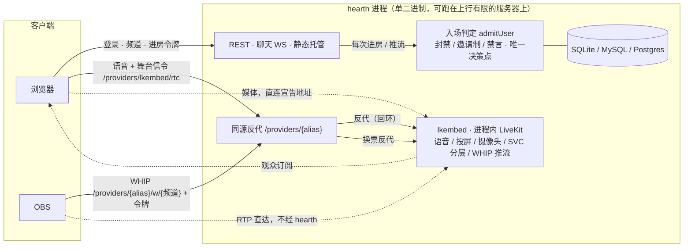

#  Hearth

自托管的低延迟语音房 + 高码率投屏（KOOK/Discord 式频道 + 可插拔媒体内核 + OBS WHIP 推流）。

## 目标

- **低延迟**：端到端 WebRTC，语音/投屏延迟 300–500ms
- **高码率投屏**：1080p60 · 8Mbps+，VP9/AV1 SVC 分层（弱网观众自动降层不拖累全场），H.264 硬编档可选
- **语音优先**：语音与投屏可拆成两条独立媒体线（双线模式），投屏挤爆上行时语音不陪葬
- **纯浏览器**：推流与观看无需插件；OBS 走标准 WHIP 协议接入
- **一体化**：单二进制 = API + 聊天 WS + 进程内 LiveKit（语音 + 舞台 + WHIP 推流一个内核）+ 信令/WHIP 反代 + 静态托管

## 架构：双线内核插槽

房间的媒体按角色拆成插槽，每个插槽独立选**服务实例**（管理后台可动态切换，即时生效；选择器的值 = 实例 alias）：

| 插槽 | 承载 | 可选实例 | 默认 |
|------|------|----------|------|
| `voice_provider` 语音线 | 麦克风音频、名册、说话检测 | 内建 `lkembed`（补丁式 fork 的 LiveKit，跑在本进程内，零外部依赖）；或任一已注册的外部 `livekit` 实例 | `lkembed` |
| `stage_provider` 舞台线 | 投屏、摄像头、OBS 推流及其伴音 | `none`（纯语音部署）；内建 `lkembed`；或任一已注册的外部 `livekit` 实例 | `lkembed` |
| 推流入口 | OBS WHIP 接入 | **不再是独立选择器**：OBS 的 WHIP 一律进当前舞台实例自带的入口（`/providers/{alias}/w/{频道}` 路径不变，alias 必须是当前舞台实例，否则 404） | — |

实例类型只剩两个：`livekit-embedded`（内建、alias 固定 `lkembed`，不接受注册）与 `livekit`（远端 `cmd/stage` 或官方 LiveKit，按此类型注册；环境变量 `LIVEKIT_API_URL` 配置了则自动合成同名锁定实例，后台只读）。语音线与舞台线同选一套实例即单连接（combined）形态，这是默认；舞台线换成远端实例仍是「语音留在进程内、投屏去上行充足的机器」的物理隔离形态。切换发生在保存配置的瞬间（内建实例热启动/热停止，不需要重启进程）。单进程默认拓扑：



实线 = 信令 / 控制面，虚线 = 媒体。语音、舞台、推流三条线**默认都在同一个进程里**：没有 redis、没有 ingress、没有第二个容器；打洞与候选宣告由 hearth 自带的 `portmap`/`Announcer` 负责，公网 IP 或映射变化不重启进程、不打断在途会话。**投屏/OBS 的视频媒体本身不经过 hearth 转发**——只走它拿到的直连/映射地址，hearth 只做鉴权、信令与同源反代，可以部署在上行很小的机器上。

更大规模或分离部署时，舞台线可以换成**独立部署的外部 LiveKit 集群**或搬到**另一台机器**（远端 `cmd/stage`，见下文），都是可选的高级形态，默认单进程已经是完整功能。

内核抽象是中性的 `rtc.Provider` / `rtc.StageProvider` / `rtc.IngestProvider` 接口（`server/internal/rtc/`），配置键按实现命名空间隔离，换实例不迁移配置；前端按凭证里的引擎名动态加载对应客户端（代码分割，LiveKit SDK 只在用到时下载）。

## 功能

- 频道语音房：说话高亮、本地电平表、多设备同账号、断线自动重连（含服务重启自愈）
- 投屏/摄像头：编码三档（VP9/AV1 SVC、H.264 单层）、码率/帧率/分辨率可调、软/硬编实时标注（浏览器 API 真值）
- OBS WHIP 推流：每用户一把推流令牌、频道写在 URL 里（换房间只改服务器地址，令牌不动），服务端不转码原样透传（2K/4K/120fps）
- 文字聊天：频道内 WebSocket，断线重连
- 管理：踢出、封禁、**服务端禁言**（落库持久、离房也可操作、全内核生效、推流入口同步拦截）、邀请制白名单；右键用户卡片直达操作
- 注册：默认邀请制（管理员发有时效链接），首个账号自动管理员
- 管理后台：内核切换（选服务实例）、**服务实例注册**（外部 LiveKit——远端 `cmd/stage` 或官方 LiveKit，alias 命名、同类型可多个；env 配置的合成同名锁定实例、后台只读）、用户/频道/邀请管理、宿主资源监控

## 技术选型

| 模块 | 方案 | 理由 |
|------|------|------|
| 媒体内核（内嵌） | LiveKit（补丁式 fork，进程内跑，`lkembed`） | 语音/投屏/推流一个内核：高码率转发、SVC 分层、自带 WHIP 入口；也可换成独立部署的外部 LiveKit |
| 后端 | Go + sqlite（`modernc.org/sqlite`，无 cgo） | 单二进制，交叉编译 ARM64 |
| 前端 | Vite + TypeScript；房间页 Solid.js，其余原生 | 主包 ~130KB；房间页状态→视图自动同步 |
| 聊天 | WebSocket | 简单可靠 |

## 目录结构

```
hearth/
├── server/
│   ├── cmd/server/          # 入口 + adduser CLI
│   └── internal/
│       ├── api/             # REST + WS 路由、入场判定(admission)、动态配置、反代
│       ├── rtc/             # 内核抽象接口 + livekitrtc 实现；livekitembed 只管进程内启停 LiveKit（接口仍由 livekitrtc 承担）
│       ├── lkroom|lktoken/  # LiveKit 管理面客户端
│       ├── chat/            # 聊天 hub
│       └── store/           # sqlite/MySQL/Postgres
├── web/                     # Vite + TS；views/room.tsx 为 Solid，其余 vanilla
├── deploy/                  # 自托管 compose + 配置模板 + init.sh（外部 LiveKit 等可选高级形态）
├── Dockerfile               # 一体化开发镜像
└── Dockerfile.release       # CI 纯装配镜像（配 .github/workflows/release.yml），语音+舞台+推流三线全在一个镜像里
```

## 下载即用（Windows / macOS / Linux 单文件）

GitHub Releases 提供六个平台的单文件产物（`hearth_<版本>_<系统>_<架构>`，Windows 为 zip，其余 tar.gz）：前端已编进二进制，解开只有一个可执行文件，跑起来浏览器打开 `http://localhost:8080` 即用（localhost 下麦克风/投屏不受 HTTPS 限制）。

- 数据（数据库、证书、日志）落在可执行文件旁的 `data/` 目录，写不进去时自动回落到系统用户数据目录；`--data <目录>` 或 `HEARTH_DATA` 可显式指定
- macOS 未签名：首次运行右键「打开」；Windows 首次监听会弹防火墙询问，点「允许」即可
- 对外开放访问（NAT 后的端口映射）见下文「自动端口映射」

## 自托管快速开始

只有一个镜像 tag，一条 `docker run` 到位（数据与密钥全部落在 `/data` 卷，挂载即持久化/备份）：

```bash
docker run -d --name hearth \
  -p 8080:8080 -p 47720:47720/udp \
  -v hearth-data:/data \
  ghcr.io/xiaoshao9704/hearth:latest
docker exec hearth /app/hearth adduser <用户名> <密码>   # 首账号自动管理员
```

放行 `47720/udp`（lkembed 媒体端口，语音与投屏同一个，公网 IP 自动探测），访问 `http://<主机>:8080` 即可开黑——选择器默认语音与舞台都选内建 `lkembed`，语音、投屏/摄像头、OBS 推流开箱全部可用，不用进管理后台改任何东西。媒体端口要在**创建容器时**一并放行，docker 的端口发布不能事后热加。

> **从旧版升级注意**：默认语音媒体端口从 `47700/udp` 变为 `47720/udp`（与投屏同一个端口）。只放行了 47700 的旧部署升级后语音会断；`portmap` 自动映射的部署不受影响。容器仍发布 47700/47710 不会报错，只是空放行，可以收掉。

密钥（`lkembed_api_key`/`lkembed_api_secret`）留空首启自动生成并落库，随 `/data` 卷一起备份；端口号在管理后台可改，改动后重启容器生效（选择器本身切换不需要重启，见上）。

> **UDP 被接管的网络**：部分网络（做策略路由/分流的家庭线路尤其常见）会让浏览器到媒体端口的 UDP 回程不通，此时靠 ICE-TCP 回落。管理后台「舞台 → ICE-TCP 端口」填成与媒体 UDP 同号（默认即 47720），容器加 `-p 47720:47720`、云侧安全组该端口 **udp/tcp 双放行**即可。
>
> **浏览器 STUN 由服务端下发**：前端不再硬编码，列表在管理后台「网络 → 浏览器 STUN 服务器」（`client_stun_servers`）改，逗号分隔、保存即生效，`none` = 不下发（连通性不依赖 STUN，兜底靠上面的 ICE-TCP）。它与实例参数 `lkembed_stun_servers`（服务端自己探测公网映射用）是两码事。

只有接入**独立部署**的外部 LiveKit（更大规模的舞台集群，或把舞台搬到另一台机器，见下文「远端舞台机器」）时才需要额外配置或额外容器——那是可选的高级形态，默认单容器已经是完整功能。

### 自动端口映射（UPnP / PCP / NAT-PMP）

NAT 后的宽带线路上，hearth **默认自动向本机默认网关申请端口映射**，不必手工进路由器后台做端口转发：映射的是 HTTP 端口（`ADDR`，默认 8080/tcp）与**当前选中内核**跑在本进程的媒体端口（进程内 LiveKit `lkembed_udp_port`）——选的是外部实例时那些端口不在本机，不申请。协议按快慢依次尝试 PCP、NAT-PMP、UPnP IGD（v1/v2 都支持），租约到期前自动续租，网关重启丢了映射下一轮自愈，进程退出时撤销。

- **仅 `network_mode: host` 或裸机可用**：bridge 容器里 SSDP 多播出不了网桥、默认网关是网桥地址，发现不到真正的网关；这不是能靠配置绕开的（网关只允许客户端给自己的源地址开洞），要自动映射就用 host 网络。
- **关闭**：管理后台「网络 → 自动端口映射」选「关闭」，或部署侧设 `PORTMAP_MODE=off`（环境变量优先，设了后台只读）。关闭时会撤销已建的映射，且启动不产生任何额外延迟。
- 申请与续租全在后台协程里，**任何失败都不影响启动**，也不会让 `/healthz` 变成非 200。

启动日志里 `portmap:` 前缀的一行诊断说明当前状态，含义与下一步：

| 诊断 | 含义与处理 |
|---|---|
| `no_gateway` | 发现不到支持 UPnP/PCP 的网关：容器 bridge 网络下发现不到（需 host 网络或裸机），或网关没开启这些功能 |
| `disabled_by_gateway` | 网关做了一次 NAT 行为探测，判定上游不支持端口转发，于是**主动禁用了整个端口转发功能**。上游若已做 DMZ/转发，这是误判：在网关上关掉该探测，或改成允许「被过滤」结果的模式 |
| `upstream_nat` | 映射建成了，但网关给出的外部地址是私网地址——上游还有一层 NAT，见下 |
| `port_conflict` | 外部端口被占用，换一个端口 |

**上游还有一层 NAT 时**（消费级路由器接在上游设备之后的二级路由形态）：hearth 会先**自动向上游那台设备也申请一次**（最多往上三层，上游开了 UPnP/PCP 就免配置），失败了才需要手工配置——在上游设备上把日志里列出的那几个端口转发到本机网关的 WAN 地址（更安全），或对它开启 DMZ（未匹配的入站全兜给它，端口不变透传）。**网关返回私网外部地址不代表映射失败**：上游配好之后这条链就是通的，只是网关自己不知道公网地址是什么，公网地址以进程内 STUN 探测的结果为准。

### 舞台内核放到局域网（远端舞台机器）

hearth 所在服务器上行有限时，投屏与 OBS 推流的视频不该绕它一圈。舞台内核（进程内 LiveKit）可以整台搬到另一台机器上：那里跑**一个** `stage` 容器就够了——它自己申请端口映射、自己探测并宣告外部地址，浏览器观众与 OBS 走同一个打洞出来的 UDP 端口，不需要 redis、ingress，也不需要单独的推流网关。镜像 `ghcr.io/xiaoshao9704/hearth-stage`，Release 里也有单文件 `stage-linux-{amd64,arm64}`（arm64 小主机可用）：

```yaml
# 舞台机器上单独一个 compose，host 网络：端口即宿主端口
stage:
  image: ghcr.io/xiaoshao9704/hearth-stage:latest
  network_mode: host
  restart: unless-stopped
  environment:
    STAGE_API_KEY: change-me                    # 与 hearth 侧 LIVEKIT_API_KEY 同值
    STAGE_API_SECRET: change-me                 # 与 hearth 侧 LIVEKIT_API_SECRET 同值（>= 32 字符）
    STAGE_HTTP_PORT: "7880"                     # API/信令；hearth 经私网访问，不必暴露公网
    STAGE_BIND: "0.0.0.0"                       # 只填 127.0.0.1 的话 hearth 连不上
    STAGE_UDP_PORT: "47720"                     # 媒体，需在防火墙放行
    # STAGE_TCP_PORT: "0"                       # ICE-TCP，UDP 全被封的网络里才开
    # STAGE_PUBLIC_IP: <公网 IP>                # 显式指定 = 只通告该地址（覆盖）；留空 = 自动
    # STAGE_STUN_SERVERS: stun.example.com:3478 # 公网映射探测用，逗号分隔；留空用内置默认
    # PORTMAP_MODE: auto                        # off 关闭自动端口映射
  healthcheck:
    test: ["CMD", "/app/stage", "healthcheck"]  # 镜像无 shell/curl，用 exec 形式
    interval: 60s
    timeout: 12s
    start_period: 20s
    retries: 3
```

hearth 侧把它当一个普通的外部 LiveKit 实例接进来——环境变量合成同名锁定实例（或在「管理后台 → 服务实例」注册一个 `livekit` 类型实例，同样的三个参数）：

```env
LIVEKIT_API_URL=http://<stage 机器的私网地址>:7880   # hearth 能访问到的地址
LIVEKIT_API_KEY=change-me
LIVEKIT_API_SECRET=change-me
LIVEKIT_URL=                                        # 留空 = 浏览器信令经 hearth 同源反代（推荐）
```

然后在管理后台把 **`stage_provider`** 选成这个实例（env 合成的锁定实例 alias 就是 `livekit`）。推流地址保持 hearth 同源：bearer 模式（OBS）服务器填 `/providers/livekit/w/{频道}`、Bearer 填推流令牌；路径模式（ffmpeg 等）用 `/providers/livekit/w/{频道}/{令牌}`。入场判定仍在 hearth 做完，通过后由 hearth 现签一张短时效 LiveKit 票换掉用户令牌反代过去，舞台机器只认票、不需要访问 hearth。语音仍走 hearth 进程内的 lkembed，与视频物理隔离。

要让局域网与外网观众都能连，**不要填 `STAGE_PUBLIC_IP`**（STUN 不可达时配 `STAGE_STUN_SERVERS`）：显式配置是覆盖语义，填成公网 IP 会让局域网客户端绕 NAT 回环。

多容器拆部署仍可用 `deploy/` 的 compose 一键起全家桶：

```bash
cd deploy && cp .env.example .env && $EDITOR .env
./init.sh && docker compose up -d --build
```

要点：

- **反代内置**：`/providers/{alias}` 下的内核信令与 WHIP、Web、API 同端口，不强制 Caddy/nginx；TLS 可用 `--profile caddy` 或接入自己的网关
- **动态配置**：环境变量（含 .env）设置的项在后台只读（LiveKit 的 env 会合成同名锁定服务实例）；未设置的可在管理后台注册服务实例、切换内核选择器，保存即生效
- **媒体端口**：hearth 进程内内核 `lkembed_udp_port`（默认 47720/udp）、外部 LiveKit RTC 端口需防火墙/安全组放行（媒体不经反代）；开了 ICE-TCP 就同号 udp/tcp 双放行；NAT 后的线路见「自动端口映射」
- **数据库**：默认 sqlite（`/data` 卷）；`DATABASE_URL` 可切 MySQL/Postgres
- **ARM64**：镜像含 arm64 变体，arm64 小主机可用

## 开发

```bash
# 后端（终端一）——零外部依赖（语音/舞台默认都走进程内 lkembed）
cd server
go run ./cmd/server   # :8080

# 前端（终端二）
cd web && npm install && npm run dev                          # :5173
```

投屏/OBS 链路默认就可用（内建 `lkembed` 进程内 LiveKit），要接一套独立部署的外部 LiveKit 才需要 `deploy/` 那套并在后台或 .env 配置。开发规范见 [CLAUDE.md](CLAUDE.md)。

发布：打 `v*` tag 触发 CI（原生交叉编译双架构 + 纯装配镜像推 ghcr，全程无 QEMU）。

## 里程碑

1. ✅ MVP：多频道 + LiveKit 音视频 + 高码率投屏 + 聊天 + OBS WHIP
2. ✅ 频道管理（踢出/封禁/禁言/邀请制）、VP9/AV1 SVC、管理后台与动态配置
3. ✅ 内核插件化：中性 Provider 抽象、双线插槽、内嵌 Ember 语音 SFU（pion/webrtc）
4. 自研舞台内核 / SRS 直播频道 / SFU 级联

## License

MIT © 2026 [xiaoshao9704](https://github.com/xiaoshao9704)，详见 [LICENSE](LICENSE)。
