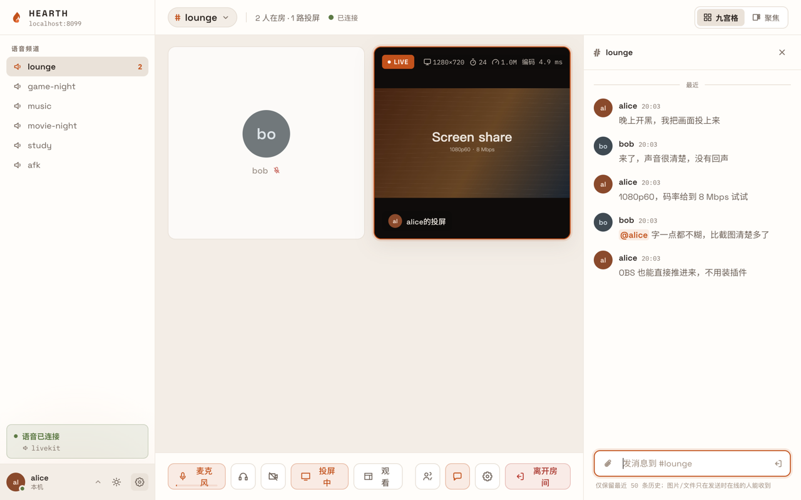

[English](README.en.md)

#  Hearth

**自建的语音 / 投屏 / OBS 推流 / 聊天房间。**

开一间频道，几个人进来说话，把画面投上去——语音、1080p60 的高码率投屏、OBS 直推、带 @ 与文件的聊天，都是一套东西。
一个二进制文件就是全部：API、媒体内核、推流入口、前端全在里面，没有 redis、没有第二个容器、不需要另装媒体服务器。
数据只落在你挂的那一个目录里，视频媒体连服务端都不经过——它只做鉴权、信令与同源反代，所以上行有限的机器也扛得住。



## 功能一览

**语音**

- SFU 转发的多人语音，进房即自动协商
- 降噪与回声消除、按键说话、挂机自动静音（AFK）
- 说话高亮、本地电平表、同账号多设备同时在房、断线自动重连（含服务端重启自愈）

**投屏与推流**

- 浏览器投屏含系统声音；摄像头同一条线
- 编码三档：VP9 / AV1 SVC 分层（弱网观众自动降层，不拖累全场）与 H.264 单层；码率、帧率、分辨率可调，软/硬编按浏览器 API 真值标注
- OBS 走标准 WHIP 直推，不装插件：频道写在服务器地址里，令牌一人一把；服务端不转码原样透传，HEVC / AV1 直通
- 剧场模式、全屏、画中画

**聊天**

- 消息经媒体内核的数据通道实时扇出，历史由服务端落库回放
- @、回复、表情反应；图片与文件直传，字节不落盘（只有当时在线的人收得到内容）
- 每人每频道可单独静音

**通知**

- 页面开着响提示音，切到后台弹系统通知，页面关着时被 @ 与被回复走离线推送（Web Push）
- 未读数上标签页标题与应用图标角标

**账号与权限**

- 通行密钥（Passkey）一次触摸即登录，密码始终保留作兜底；会话可远程下线
- 注册默认邀请制，首个账号自动成为超级管理员
- 访客邀请可只放进指定频道，转正为注册账号默认关闭（`guest_claim`）
- 系统角色五档 `guest < user < power < admin < super`，频道角色三档 `owner / moderator / member`

**部署**

- Windows / macOS / Linux 单文件，可装成系统服务；docker 一个镜像到位
- NAT 后自动向网关申请端口映射（PCP / NAT-PMP / UPnP IGD）
- 公网 IP 或映射变化不重启进程、不打断在途会话
- 舞台线（投屏与推流）可整台搬到上行更好的另一台机器

**诊断**

- 每条线的 RTT、抖动、丢包与传输方式（UDP / TCP 兜底 / 中继兜底），5 秒刷新
- 投屏卡片给出收侧缓冲与解码耗时、发侧编码耗时与受限原因
- 端到端延迟标尺（`#/latency`）：从采集、编码、转发到解码、渲染的全程毫秒数

## 三分钟跑起来

### docker compose

```yaml
services:
  hearth:
    image: ghcr.io/xiaoshao9704/hearth:latest
    restart: unless-stopped
    ports:
      - "8080:8080"
      - "47720:47720/udp"
      - "47720:47720/tcp"
    volumes:
      - hearth-data:/data

volumes:
  hearth-data:
```

```bash
docker compose up -d
docker exec hearth /app/hearth adduser <用户名> <密码>   # 首个账号自动成为 super
```

打开 `http://<主机>:8080` 就能开黑：语音、投屏 / 摄像头、OBS 推流开箱全部可用，不用进管理后台改任何东西。

- `47720/udp` 是媒体端口（语音与投屏同一个，公网 IP 自动探测），必须在防火墙 / 安全组放行。**docker 的端口发布不能事后热加**，创建容器时就要一并写上。
- `47720/tcp` 只在 UDP 被中间设备接管的网络才用得上：管理后台「舞台 → ICE-TCP 端口」填成与媒体 UDP 同号（默认 47720）后生效，云侧安全组该端口 udp/tcp 双放行。
- `/data` 卷是唯一的持久化边界：数据库与自动生成的密钥都在里面，挂载即持久化 / 备份。

### 单文件（Windows / macOS / Linux）

Release 里每个平台一个可执行文件，前端已编进二进制，解开只有一个文件：

```bash
./hearth                 # 监听 :8080
./hearth adduser alice <密码>
./hearth service install # 装成系统服务（可选）
```

浏览器打开 `http://localhost:8080` 即用——localhost 下麦克风与投屏不受 HTTPS 限制。数据落在可执行文件旁的 `data/` 目录，写不进去时自动回落系统用户数据目录；`--data <目录>` 或 `HEARTH_DATA` 可显式指定。macOS 未签名，首次运行右键「打开」；Windows 首次监听会弹防火墙询问，点「允许」。

### 放在反代后面

`/providers/{alias}` 下的内核信令与 WHIP 与 Web、API 同端口，不强制 Caddy / nginx。要接自己的网关时有三个要点：

- 透传 `Host`：通行密钥的 RP ID 与离线推送的联系地址都按它推导
- 透传 `X-Forwarded-Proto`：终止 TLS 的部署靠它推出 `https://…` 的 origin
- 允许 WebSocket 升级：信令走的是 WebSocket
- **媒体端口不经反代**，直接放行到宿主

## 部署形态

**一台机器（默认）。** 语音、舞台、推流三条线都在 hearth 进程里的内建实例 `lkembed`（补丁式 fork 的 LiveKit，进程内跑）上。没有第二个进程、没有 redis、没有 ingress。这已经是完整功能，下面两种是可选的高级形态。

**舞台线搬到另一台机器。** hearth 所在服务器上行有限时，投屏与 OBS 推流的视频不该绕它一圈。在另一台机器上跑**一个** `stage` 容器（镜像 `ghcr.io/xiaoshao9704/hearth-stage`，Release 里也有单文件 `stage-linux-amd64` / `stage-linux-arm64`）：它自己申请端口映射、自己探测并宣告外部地址，浏览器观众与 OBS 走同一个打洞出来的 UDP 端口。hearth 侧把它当一个普通的外部 `livekit` 实例接进来（`LIVEKIT_API_URL/KEY/SECRET` 环境变量合成锁定实例，或在管理后台注册），然后把 `stage_provider` 选成它；语音仍留在进程内的 `lkembed`，与视频物理隔离。要让局域网与外网观众都能连，**不要**填 `STAGE_PUBLIC_IP`——显式配置是覆盖语义，填成公网 IP 会让局域网客户端绕 NAT 回环。

**接官方 LiveKit。** 更大规模时舞台线可以指向独立部署的 LiveKit 集群，同样是注册一个 `livekit` 类型实例。注意聊天用的 Data Streams 需要内核服务端 ≥ 1.8（`lkembed` 与 `stage` 镜像均满足）。

## 配置

优先级：**环境变量（锁定，后台只读）> 数据库 settings（管理后台改，保存即生效）> 实现声明的默认值**。例外是两个内核选择器：它们不读环境变量，一律走管理后台落库。

### 管理后台的键

| 键 | 默认 | 说明 |
|---|---|---|
| `voice_provider` | `lkembed` | 语音线用哪个服务实例（值是实例 alias） |
| `stage_provider` | `lkembed` | 舞台线（投屏 / 摄像头 / OBS 推流）用哪个实例；`none` = 纯语音部署 |
| `lkembed_udp_port` | `47720` | 内建内核的媒体 UDP 单端口，需放行；改动重启生效 |
| `lkembed_tcp_port` | `0` | ICE-TCP 端口，`0` = 关；UDP 被接管的网络建议与媒体端口同号 |
| `lkembed_port` | `47730` | 内建内核的信令端口，只监听回环，浏览器经同源反代访问 |
| `lkembed_api_key` / `lkembed_api_secret` | 空 | 留空 = 首次启动自动生成并落库（随数据库备份） |
| `lkembed_public_ip` | 空 | 留空 = 宣告全部网卡地址与 STUN 探测到的公网映射；显式设置则只通告该地址 |
| `lkembed_extra_ips` | 空 | 逗号分隔的额外候选地址，与自动探测结果并列宣告 |
| `lkembed_stun_servers` | 空 | 服务端探测自身公网映射用；留空用内置默认，不可达时改填 |
| `lkembed_log_level` | `warn` | `debug` / `info` / `warn` / `error` |
| `portmap_mode` | `auto` | `auto` = 向网关申请 UPnP / PCP / NAT-PMP 映射；`off` = 关闭并撤销已建映射 |
| `client_stun_servers` | `stun.miwifi.com:3478,stun.l.google.com:19302` | 下发给浏览器的 STUN 列表，逗号分隔；`none` = 不下发 |
| `chat_data_line` | `auto` | 聊天走哪条线的数据通道：`auto` / `voice` / `stage` |
| `chat_file_max_mb` | `25` | 聊天文件大小上限；扇出成本 = 大小 × 在线人数 |
| `chat_retention_days` | `30` | 超期消息定时清理，`0` = 永久保留 |
| `passkey_rp_id` | 空 | 留空 = 取请求 `Host` 去端口；**改动会让已注册的通行密钥全部失效** |
| `passkey_origins` | 空 | 逗号分隔的完整 origin；留空 = 只允许当前请求的 origin |
| `webpush_vapid_public` / `webpush_vapid_private` | 空 | 留空 = 首次用到时自动生成一对；改动让所有离线推送订阅立即失效 |
| `webpush_subject` | 空 | 写进 VAPID 断言的联系方式；留空 = `mailto:admin@<当前 Host>` |
| `audit_retention_days` | `180` | 管制动作记录保留天数，`0` = 永久保留 |
| `guest_ttl_sec` | `86400` | 注册邀请勾了「允许先以访客进入」时产出访客的存活时长 |
| `guest_claim` | `off` | `on` = 允许访客把当前身份转成注册账号（user_id 不变） |

`client_stun_servers`（下发给浏览器）与 `lkembed_stun_servers`（服务端自己探测公网映射）是两码事，别混。

### 环境变量

| 变量 | 默认 | 说明 |
|---|---|---|
| `ADDR` | `:8080` | HTTP 监听地址 |
| `HEARTH_DATA` | 见下 | 数据目录；也可用 `--data <目录>`。默认优先可执行文件旁的 `data/`，写不进去回落系统用户目录 |
| `DB_PATH` | `<data>/hearth.db` | sqlite 文件路径（`DATABASE_URL` 为空时使用） |
| `DATABASE_URL` | 空 | `mysql://` 或 `postgres://` 切换数据库后端 |
| `SITE_NAME` | `Hearth` | 站点名，下发给前端展示 |
| `PUBLIC_URL` | 空 | 站点公开地址（拼邀请链接用）；留空按请求推导 |
| `REG_POLICY` | `invite` | 注册策略默认值 `closed` / `invite` / `open`（可被后台设置覆盖） |
| `REGISTRATION_OPEN` | 空 | 旧变量，`true` 等价 `REG_POLICY=open` |
| `CORS_ORIGIN` | `*` | 允许的跨域来源 |
| `STATIC_DIR` | 空 | 外置前端目录；二进制内嵌了产物时不用 |
| `PORTMAP_MODE` | `auto` | 同名配置键的环境变量形态（设了后台只读） |
| `CLIENT_STUN_SERVERS` | 见上表 | 同上 |
| `CHAT_DATA_LINE` / `CHAT_FILE_MAX_MB` | 见上表 | 同上 |
| `AUDIT_RETENTION_DAYS` | `180` | 同上 |
| `PASSKEY_RP_ID` / `PASSKEY_ORIGINS` | 空 | 同上 |
| `LKEMBED_PUBLIC_IP` / `LKEMBED_EXTRA_IPS` / `LKEMBED_STUN_SERVERS` | 空 | 同上 |
| `LIVEKIT_API_URL` | 空 | 设了就自动合成一个 alias 为 `livekit` 的锁定实例（后台只读） |
| `LIVEKIT_API_KEY` / `LIVEKIT_API_SECRET` | 空 | 该实例的凭证 |
| `LIVEKIT_URL` | 空 | 浏览器可见地址；留空 = 信令经 hearth 同源反代（推荐） |

`.env` 先读工作目录再读 `<data>/.env`，后者不覆盖前者。`EMBER_*` / `BELLOWS_*` / `INGRESS_UPSTREAM_URL` 是已删内核的痕迹，不再读取，检测到会打一次启动告警，请从部署侧删除；`VOICE_PROVIDER` / `STAGE_PROVIDER` 已由迁移一次性落库，此后不再读取。

远端 `stage` 进程的配置只来自环境变量：`STAGE_API_KEY` / `STAGE_API_SECRET`（必填，与 hearth 侧的 `LIVEKIT_API_KEY/SECRET` 同值，secret ≥ 32 字符）、`STAGE_HTTP_PORT`（默认 `7880`）、`STAGE_BIND`（默认 `0.0.0.0`，填 `127.0.0.1` 的话 hearth 连不上）、`STAGE_UDP_PORT`（默认 `47720`）、`STAGE_TCP_PORT`（默认 `0`）、`STAGE_LOG_LEVEL`（默认 `warn`）、`STAGE_PUBLIC_IP`、`STAGE_STUN_SERVERS`、`PORTMAP_MODE`。

### 命令行

```
hearth                                  启动服务
hearth adduser <用户名> <密码>          建账号（空库的首个账号自动成为 super）
hearth promote <用户名>                 转移超级管理员（旧 super 降为 admin）
hearth healthcheck                      探活本机 /healthz，容器健康检查用（不开数据库）
hearth service install|uninstall|start|stop|status [--system]
                                        服务化：macOS 用户级 LaunchAgent、Linux systemd
                                        用户级或 --system 系统级、Windows SCM
```

全局参数：`--data <目录>` 指定数据目录，`--service` 由服务单元自带（日志转投 `<data>/hearth.log`，按 10MB、5 份备份轮转）。

## 常见问题

**语音连不上，或者进房后一直「连接中」。** 先确认媒体端口放行了：默认 `47720/udp`，容器要在创建时就发布。UDP 全被封或被中间设备接管（做策略路由 / 分流的线路尤其常见）时，把管理后台的「ICE-TCP 端口」设成与媒体 UDP 同号，安全组该端口 udp/tcp 双放行。启动日志里 `portmap:` 那行诊断说明 NAT 侧的状态：`no_gateway`（发现不到支持 UPnP/PCP 的网关，容器 bridge 网络必然如此，要自动映射就用 host 网络）、`disabled_by_gateway`（网关的 NAT 行为探测误判，在网关上关掉该探测）、`upstream_nat`（上游还有一层 NAT，hearth 会自动往上申请最多三层，失败了就在上游设备上手工转发那几个端口或开 DMZ）、`port_conflict`（外部端口被占，换一个）。

**默认 STUN 在部分地区不可达。** 服务端自己探测公网映射用的是 `lkembed_stun_servers`，浏览器用的是 `client_stun_servers`，两个都能改成可达地址，逗号分隔并列几个即可（浏览器并行探测、谁先回用谁）。连通性本身不依赖 STUN——客户端永远是主动方，服务端从收到的包学到对端地址；兜底靠 ICE-TCP。

**iPhone / iPad 收不到通知。** 必须先在 Safari 里「添加到主屏幕」，从那个图标打开后才有推送权限；普通标签页里连开关都点不开。另外站点必须是 https（`localhost` 例外），服务端也要能出网访问浏览器给出的推送网关——通道由浏览器厂商决定，hearth 只按 VAPID 把密文交出去，送不到就静默。

**换了域名，通行密钥全失效了。** 浏览器把凭证按 RP ID 绑定，`hearth.example.com` 与 `example.com` 是两个不同的 RP ID，不能互换。换域名前先告知用户，换完让他们重新添加一枚（密码登录不受影响）。想让凭证绑在主域名上就显式填 `passkey_rp_id`。裸 IP 不能当 RP ID。

**OBS 怎么填。** 服务器填 `https://<你的站点>/providers/{当前舞台实例 alias}/w/{频道}`，Bearer Token 填推流令牌；地址与令牌在房间顶栏点频道名 →「OBS 推流地址…」一键复制。不支持 Bearer 的工具（ffmpeg 等）用路径形态 `…/w/{频道}/{令牌}`。alias 必须是当前舞台实例，否则 404。频道段既可以是 id 也可以是名字，OBS 里存着的旧名字地址永久有效。

## 架构

媒体按角色拆成两个插槽——语音线与舞台线——每个插槽独立选一个**服务实例**（管理后台可动态切换，保存即生效，内建实例热启停不需要重启进程）。实例类型只有两个：内建的 `livekit-embedded`（alias 固定 `lkembed`）与外部的 `livekit`（远端 `cmd/stage` 或官方 LiveKit，同类型可注册多个）。两线同选一套实例即单连接形态，这是默认。推流入口不是独立选择器：OBS 的 WHIP 一律进当前舞台实例自带的入口。「谁能进房、能否发布」只有一个决策函数（`admitUser`），凭证签发与 WHIP 拦截两条路都调它；身份键一律是 `user_id`（用户名只做展示与登录），管制状态的权威在数据库、内核只是现场执行器。内核抽象是中性的 `rtc.Provider` / `rtc.StageProvider` 接口，换实例不迁移配置；前端按凭证里的引擎名动态加载客户端，代码分割。

细节见 [CLAUDE.md](CLAUDE.md) 的「架构铁律」与 [`docs/`](docs/) 下的计划文档。

## 开发

```bash
# 后端（终端一）——零外部依赖，语音与舞台默认都走进程内 lkembed
cd server && go run ./cmd/server        # :8080

# 前端（终端二）
cd web && npm install && npm run dev    # :5173
```

提交前必须过：`cd server && go build ./... && go vet ./...`；`cd web && npx tsc --noEmit && npm run build`。

发布：打 `v*` tag 触发 CI（[`.github/workflows/release.yml`](.github/workflows/release.yml)），原生交叉编译六个平台的单文件产物 + 纯装配多架构镜像推 ghcr.io，全程无 QEMU。产物名 `hearth_<版本>_<系统>_<架构>.tar.gz`（Windows 为 `.zip`）与 `stage-linux-{amd64,arm64}`；镜像 `ghcr.io/xiaoshao9704/hearth` 与 `ghcr.io/xiaoshao9704/hearth-stage`。

宣传页在 [`site/`](site/)：纯静态单文件，`site/**` 变化时由 [`.github/workflows/pages.yml`](.github/workflows/pages.yml) 发布到 GitHub Pages（需在仓库 Settings → Pages 里把来源选成 GitHub Actions）。

## 里程碑

1. ✅ MVP：多频道 + 音视频 + 高码率投屏 + 聊天 + OBS WHIP
2. ✅ 频道管理（踢出 / 封禁 / 禁言 / 邀请制）、VP9 / AV1 SVC、管理后台与动态配置
3. ✅ 内核插件化：中性 Provider 抽象、双线插槽、进程内嵌媒体内核
4. ✅ 单二进制三系统分发与服务化、通行密钥、离线推送、自动端口映射
5. SFU 级联 / 直播频道

## License

MIT © 2026 [xiaoshao9704](https://github.com/xiaoshao9704)，详见 [LICENSE](LICENSE)。
