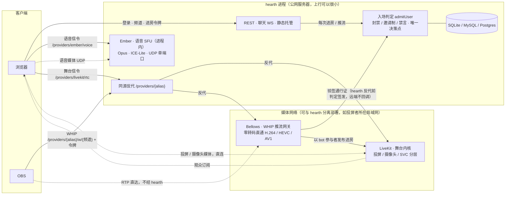

#  Hearth

自托管的低延迟语音房 + 高码率投屏（KOOK/Discord 式频道 + 可插拔媒体内核 + OBS WHIP 推流）。

## 目标

- **低延迟**：端到端 WebRTC，语音/投屏延迟 300–500ms
- **高码率投屏**：1080p60 · 8Mbps+，VP9/AV1 SVC 分层（弱网观众自动降层不拖累全场），H.264 硬编档可选
- **语音优先**：语音与投屏可拆成两条独立媒体线（双线模式），投屏挤爆上行时语音不陪葬
- **纯浏览器**：推流与观看无需插件；OBS 走标准 WHIP 协议接入
- **一体化**：单二进制 = API + 聊天 WS + 内嵌语音 SFU + 信令/WHIP 反代 + 静态托管

## 架构：双线内核插槽

房间的媒体按角色拆成插槽，每个插槽独立选**服务实例**（管理后台可动态切换，即时生效；选择器的值 = 实例 alias）：

| 插槽 | 承载 | 可选实例 |
|------|------|----------|
| `voice_provider` 语音线 | 麦克风音频、名册、说话检测 | 内建 `ember`（Ember，进程内纯音频 SFU，零外部依赖，默认）；或任一已注册 `livekit` 实例 |
| `stage_provider` 舞台线 | 投屏、摄像头、OBS 推流及其伴音 | `none`（纯语音部署，默认）；或任一已注册 `livekit` 实例 |
| `ingest_provider` 推流入口 | OBS WHIP 接入 | 内建 `bellows`（Bellows，进程内直通网关，支持 HEVC/AV1，默认）；或已注册 `livekit-ingress` / `bellows-remote` 实例 |

外部服务（LiveKit / LiveKit Ingress / 远端 Bellows）在管理后台「服务实例」按类型注册：alias 命名、同类型可注册多个；环境变量（`LIVEKIT_API_URL`、`INGRESS_UPSTREAM_URL`、`BELLOWS_REMOTE_URL`）配置了则自动合成同名锁定实例（后台只读）。两线选同一 livekit 实例时自动合并为单连接（combined，即传统单线形态）。推荐拓扑：



实线 = 信令 / 控制面，虚线 = 媒体。**视频媒体（投屏、OBS 推流）不经过 hearth**：hearth 只做鉴权、信令与同源反代，可以跑在上行很小的机器上；语音走进程内 Ember，与视频物理隔离，投屏挤爆上行时语音不陪葬。Bellows 也可跑在 hearth 进程内（单机形态）。

内核抽象是中性的 `rtc.Provider` / `rtc.IngestProvider` 接口（`server/internal/rtc/`），配置键按实现命名空间隔离，换内核不迁移配置；前端按凭证里的引擎名动态加载对应客户端（代码分割，LiveKit SDK 只在用到时下载）。

## 功能

- 频道语音房：说话高亮、本地电平表、多设备同账号、断线自动重连（含服务重启自愈）
- 投屏/摄像头：编码三档（VP9/AV1 SVC、H.264 单层）、码率/帧率/分辨率可调、软/硬编实时标注（浏览器 API 真值）
- OBS WHIP 推流：每用户一把推流令牌、频道写在 URL 里（换房间只改服务器地址，令牌不动），服务端不转码原样透传（2K/4K/120fps）
- 文字聊天：频道内 WebSocket，断线重连
- 管理：踢出、封禁、**服务端禁言**（落库持久、离房也可操作、全内核生效、推流入口同步拦截）、邀请制白名单；右键用户卡片直达操作
- 注册：默认邀请制（管理员发有时效链接），首个账号自动管理员
- 管理后台：内核切换（选服务实例）、**服务实例注册**（LiveKit / LiveKit Ingress / 远端 Bellows，alias 命名、同类型可多个；env 配置的合成同名锁定实例、后台只读）、用户/频道/邀请管理、宿主资源监控

## 技术选型

| 模块 | 方案 | 理由 |
|------|------|------|
| 语音内核（内嵌） | pion/webrtc v4，ICE-Lite + UDP 单端口 | 进程内零依赖，公网直连免 STUN/TURN |
| 媒体内核（可选） | LiveKit + Ingress（WHIP） | 高码率转发、SVC、OBS 接入 |
| 后端 | Go + sqlite（`modernc.org/sqlite`，无 cgo） | 单二进制，交叉编译 ARM64 |
| 前端 | Vite + TypeScript；房间页 Solid.js，其余原生 | 主包 ~130KB；房间页状态→视图自动同步 |
| 聊天 | WebSocket | 简单可靠 |

## 目录结构

```
hearth/
├── server/
│   ├── cmd/server/          # 入口 + adduser CLI
│   └── internal/
│       ├── api/             # REST + WS 路由、入场判定(admission)、动态配置、反代
│       ├── rtc/             # 内核抽象接口 + livekitrtc / ember / bellows 三个实现
│       ├── lkroom|lkingress|lktoken/  # LiveKit 管理面客户端
│       ├── chat/            # 聊天 hub
│       └── store/           # sqlite/MySQL/Postgres
├── web/                     # Vite + TS；views/room.tsx 为 Solid，其余 vanilla
├── deploy/                  # 自托管 compose + 配置模板 + init.sh
├── Dockerfile               # 一体化开发镜像
├── Dockerfile.release       # CI 纯装配镜像（配 .github/workflows/release.yml）
└── Dockerfile.aio           # 自包含镜像：-livekit / -full 两档（进程编排 server/cmd/aioinit）
```

## 自托管快速开始

镜像分三档，按需选一条 `docker run`（数据、密钥与内嵌服务配置全部落在 `/data` 卷，挂载即持久化/备份）：

| tag | 内容 | 体积 |
|---|---|---|
| `latest` / `X` | 纯 hearth（Ember 语音 + 聊天 + 管理） | ~36MB |
| `X-livekit` | + 内嵌 LiveKit（投屏/摄像头/弱网 SVC） | ~110MB |
| `X-full` | + 内嵌 redis + ingress（OBS WHIP 推流） | ~600MB |

最小形态**只需要 hearth 一个容器**（选择器默认即 ember 语音 + 关闭舞台线，内核选择在管理后台改）：

```bash
docker run -d --name hearth \
  -p 8080:8080 -p 47700:47700/udp \
  -v hearth-data:/data \
  ghcr.io/xiaoshao9704/hearth:latest
docker exec hearth /app/hearth adduser <用户名> <密码>   # 首账号自动管理员
```

放行 `47700/udp`（语音媒体，公网 IP 自动探测），访问 `http://<主机>:8080` 即可开黑。要投屏/OBS 时再于管理后台「服务实例」注册 LiveKit 实例并把舞台线切过去——或直接选自包含档，内嵌服务开箱即用：

```bash
# -livekit 档：内嵌 LiveKit，投屏/摄像头全功能（放行 7881、7882/udp）
docker run -d --name hearth \
  -p 8080:8080 -p 7881:7881 -p 7882:7882/udp \
  -v hearth-data:/data \
  ghcr.io/xiaoshao9704/hearth:latest-livekit

# -full 档：再加内嵌 redis + ingress，OBS 可 WHIP 推流（再放行 7888、7885/udp、7886）
docker run -d --name hearth \
  -p 8080:8080 -p 7881:7881 -p 7882:7882/udp -p 7888:7888 -p 7885:7885/udp -p 7886:7886 \
  -v hearth-data:/data \
  ghcr.io/xiaoshao9704/hearth:latest-full
```

自包含档约定：密钥首启生成于 `/data/aio/keys.env`（持久化）；`livekit.yaml`/`ingress.yaml` 每次重启按环境变量重生成（**手改不保留**），端口等参数用 `LIVEKIT_PORT`、`LIVEKIT_TCP_PORT`、`LIVEKIT_UDP_PORT`、`INGRESS_WHIP_PORT`、`INGRESS_UDP_PORT`、`INGRESS_TCP_PORT` 覆盖；`EMBED_LIVEKIT=0` / `EMBED_INGRESS=0` 可临时关闭内嵌服务；默认 STUN 不可达（国内）时用 `LIVEKIT_STUN_SERVERS=stun.miwifi.com:3478` 指定，否则内嵌 LiveKit 启动即退出；`-full` 档的 redis 默认内嵌，`REDIS_ADDR` 可改用外部实例（`host:port` 或 `redis://[user:pass@]host:port[/db]`，密码含 `#` 等特殊字符需百分号转义，语义同 `DATABASE_URL`）。

### 自动端口映射（UPnP / PCP / NAT-PMP）

NAT 后的宽带线路上，hearth **默认自动向本机默认网关申请端口映射**，不必手工进路由器后台做端口转发：映射的是 HTTP 端口（`ADDR`，默认 8080/tcp）与**当前选中内核**跑在本进程的媒体端口（Ember 语音 `ember_udp_port`、进程内 Bellows 推流 `bellows_udp_port`）——选的是外部实例时那些端口不在本机，不申请。协议按快慢依次尝试 PCP、NAT-PMP、UPnP IGD（v1/v2 都支持），租约到期前自动续租，网关重启丢了映射下一轮自愈，进程退出时撤销。

- **仅 `network_mode: host` 或裸机可用**：bridge 容器里 SSDP 多播出不了网桥、默认网关是网桥地址，发现不到真正的网关；这不是能靠配置绕开的（网关只允许客户端给自己的源地址开洞），要自动映射就用 host 网络。
- **关闭**：管理后台「网络 → 自动端口映射」选「关闭」，或部署侧设 `PORTMAP_MODE=off`（环境变量优先，设了后台只读）。关闭时会撤销已建的映射，且启动不产生任何额外延迟。
- 申请与续租全在后台协程里，**任何失败都不影响启动**，也不会让 `/healthz` 变成非 200。

启动日志里 `portmap:` 前缀的一行诊断说明当前状态，含义与下一步：

| 诊断 | 含义与处理 |
|---|---|
| `no_gateway` | 发现不到支持 UPnP/PCP 的网关：容器 bridge 网络下发现不到（需 host 网络或裸机），或网关没开启这些功能 |
| `disabled_by_gateway` | 网关做了一次 NAT 行为探测，判定上游不支持端口转发，于是**主动禁用了整个端口转发功能**。上游若已做 DMZ/转发，这是误判：在网关上关掉该探测，或改成允许「被过滤」结果的模式 |
| `upstream_nat` | 映射建成了，但网关给出的外部地址是私网地址——上游还有一层 NAT，见下 |
| `port_conflict` | 外部端口被占用，换一个端口 |

**上游还有一层 NAT 时**（消费级路由器接在上游设备之后的二级路由形态）：hearth 会先**自动向上游那台设备也申请一次**（最多往上三层，上游开了 UPnP/PCP 就免配置），失败了才需要手工配置——在上游设备上把日志里列出的那几个端口转发到本机网关的 WAN 地址（更安全），或对它开启 DMZ（未匹配的入站全兜给它，端口不变透传）。**网关返回私网外部地址不代表映射失败**：上游配好之后这条链就是通的，只是网关自己不知道公网地址是什么，公网地址以进程内 STUN 探测的结果为准。

### OBS 推流网关放到局域网（Bellows 远端形态）

hearth 所在服务器上行有限、LiveKit 部署在别处时，OBS 的视频不该绕 hearth 一圈。Bellows 远端进程随 hearth 镜像分发（`/app/bellows`，Release 里也有单文件 `bellows-linux-{amd64,arm64}`），放到 LiveKit 同一局域网的任意机器（低功耗 arm64 小主机即可）：

```yaml
# 与 LiveKit 同一 compose，host 网络：端口即宿主端口
bellows:
  image: ghcr.io/xiaoshao9704/hearth:latest
  entrypoint: ["/app/bellows"]
  network_mode: host
  environment:
    BELLOWS_SHARED_SECRET: <随机串>              # 与 hearth 侧同值（hearth 签通行证、远端验签）
    LIVEKIT_API_URL: http://127.0.0.1:7880
    LIVEKIT_API_KEY: …
    LIVEKIT_API_SECRET: …
    BELLOWS_ADDR: ":8090"                        # WHIP 信令
    BELLOWS_UDP_PORT: "47710"                    # 媒体
    BELLOWS_PUBLIC_IP: 192.168.1.20              # 显式指定 = 只通告该地址（覆盖）；留空 = 自动宣告全部网卡地址 + STUN 探测的公网映射
    # BELLOWS_STUN_SERVERS: stun.miwifi.com:3478 # 公网映射探测用，逗号分隔；留空用内置默认
    # BELLOWS_SINK: livekit                      # 发布出口（rtc.Publisher 实现），默认 livekit，一般不设
  healthcheck:                                   # 兼做宣告探测的刷新触发：公网 IP 变化后新会话在 interval 内拿到新候选，无需重启
    test: ["CMD", "/app/bellows", "healthcheck"]        # 镜像无 shell/curl，用 exec 形式
    interval: 60s
    timeout: 12s
    start_period: 20s
    retries: 3
```

要让局域网与外网推流者都能连，**删掉 `BELLOWS_PUBLIC_IP`** 让它自动宣告（STUN 不可达时配 `BELLOWS_STUN_SERVERS`），而不是改成公网 IP——显式配置是覆盖语义，改成公网 IP 会让局域网推流绕 NAT 回环。

hearth 侧在「管理后台 → 服务实例」注册一个 **bellows-remote** 实例（或用环境变量 `BELLOWS_REMOTE_URL` / `BELLOWS_SHARED_SECRET` 合成同名锁定实例）：`remote_url` 填 hearth 能访问到的该机器地址（如 `http://192.168.1.20:8090`），共享密钥填同一值。用户的推流地址**保持 hearth 同源**（alias 即该实例名）：推流令牌每用户一把（设置页可取、可重置），频道写在 URL 里——bearer 模式（OBS）服务器填 `/providers/{alias}/w/{频道}`、Bearer 令牌填推流令牌；路径模式（ffmpeg 等）直接用 `/providers/{alias}/w/{频道}/{令牌}`。hearth 在反代前做完入场判定并签发短时效通行证随请求头带给远端，远端本地验签、**不需要访问 hearth**；信令经 hearth 反代（TLS 不变、OBS 地址不变），媒体按通告地址直达远端。外网推流者才需要端口映射/TLS——远端 bellows 同样默认申请自动端口映射（媒体 UDP 口与 WHIP HTTP 口，同样只在 host 网络/裸机下可用，`PORTMAP_MODE=off` 关闭），见上一节。

从旧版（每用户每频道一把密钥）升级时注意三点：hearth 与远端 bellows **同版本一起升级**（通行证字段变了，旧远端不认新 grant）；启动迁移自动把每用户最近创建的一把旧密钥保留为新令牌，其余丢弃；OBS 只需给服务器地址加上频道段（`/providers/{alias}/w/{频道}`），令牌沿用迁移保留的那把。

多容器拆部署仍可用 `deploy/` 的 compose 一键起全家桶：

```bash
cd deploy && cp .env.example .env && $EDITOR .env
./init.sh && docker compose up -d --build
```

要点：

- **反代内置**：`/providers/{alias}` 下的内核信令与 WHIP、Web、API 同端口，不强制 Caddy/nginx；TLS 可用 `--profile caddy` 或接入自己的网关
- **动态配置**：环境变量（含 .env）设置的项在后台只读（LiveKit / Ingress 的 env 会合成同名锁定服务实例）；未设置的可在管理后台注册服务实例、切换内核选择器，保存即生效
- **媒体端口**：语音 `EMBER_UDP_PORT`（默认 47700/udp）、LiveKit RTC 端口需防火墙/安全组放行（媒体不经反代）；NAT 后的线路见「自动端口映射」
- **数据库**：默认 sqlite（`/data` 卷）；`DATABASE_URL` 可切 MySQL/Postgres
- **ARM64**：镜像含 arm64 变体，arm64 小主机可用

## 开发

```bash
# 后端（终端一）——纯语音开发零外部依赖
cd server
go run ./cmd/server   # :8080（选择器默认即 ember 语音 + 关闭舞台线）

# 前端（终端二）
cd web && npm install && npm run dev                          # :5173
```

需要投屏/OBS 链路时本地起一套 LiveKit（见 `deploy/`）并在后台或 .env 配置。开发规范见 [CLAUDE.md](CLAUDE.md)。

发布：打 `v*` tag 触发 CI（原生交叉编译双架构 + 纯装配镜像推 ghcr，全程无 QEMU）。

## 里程碑

1. ✅ MVP：多频道 + LiveKit 音视频 + 高码率投屏 + 聊天 + OBS WHIP
2. ✅ 频道管理（踢出/封禁/禁言/邀请制）、VP9/AV1 SVC、管理后台与动态配置
3. ✅ 内核插件化：中性 Provider 抽象、双线插槽、内嵌 Ember 语音 SFU（pion/webrtc）
4. 自研舞台内核 / SRS 直播频道 / SFU 级联

## License

MIT © 2026 [xiaoshao9704](https://github.com/xiaoshao9704)，详见 [LICENSE](LICENSE)。
